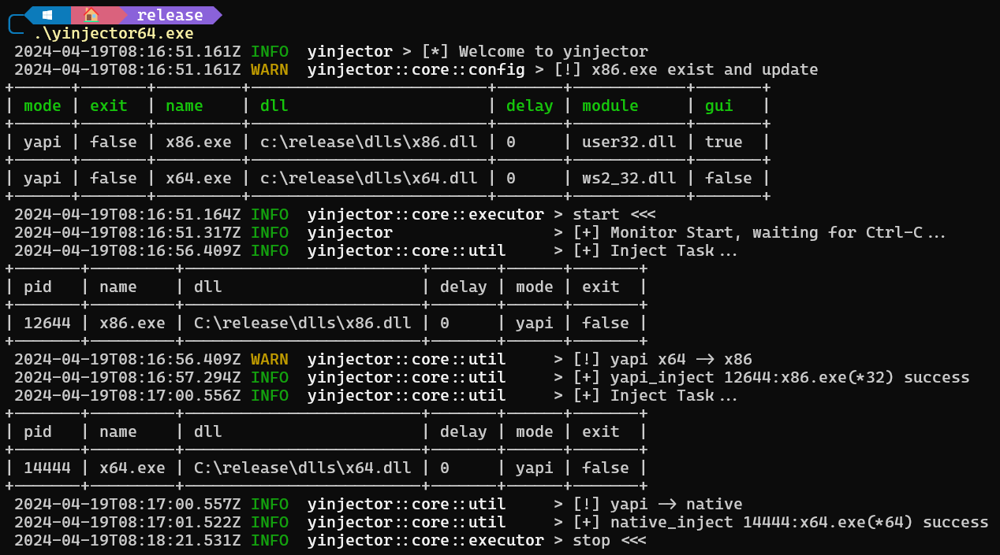

## windows-injector
[](https://github.com/piz-ewing/injector/blob/main/LICENSE)


- ✨ Fusion injector
- 👍 Easy to configure
- 🚅 Automatically monitor processes

## build
```bash
# windows-x86
cargo b --target=i686-pc-windows-msvc

# windows-x64
cargo b --target=x86_64-pc-windows-msvc

# for release
$env:RUSTFLAGS="--remap-path-prefix $HOME=~"
```

## config
```toml
[global]
monitor_interval = 50

# when YAPI injection fails, try native
native = false

[process]
"a.exe" = 'a.dll'
"b.exe" = '../b.dll'
"c.exe" = 'c:\c.dll'

"x86.exe"='x86.dll'
"x64.exe"='x64.dll'

// inject when find title
[window]
"x86.exe" = "window_title"
```
## run

```
./injector.exe [config_path]
```



## todo
- ✅ ~~Merge x86 and x64 injector~~

- 📝 Better way for merge x86 and x64 injector

- ⌨️ [More ways to inject](https://github.com/HackerajOfficial/injectAllTheThings)

- ⌨️ organize 'window' injection code

## ref

***Maybe I'll modify it, so I don't import using subprojects***

[YAPI -- Yet Another Process Injector](https://github.com/ez8-co/yapi.git) @ez8-co

[pretty-env-logger](https://github.com/seanmonstar/pretty-env-logger.git) @seanmonstar

[remove absolute paths in release binary](https://users.rust-lang.org/t/how-to-remove-absolute-paths-in-release-binary/75969)

[windows-win-rs](https://github.com/DoumanAsh/windows-win-rs.git)