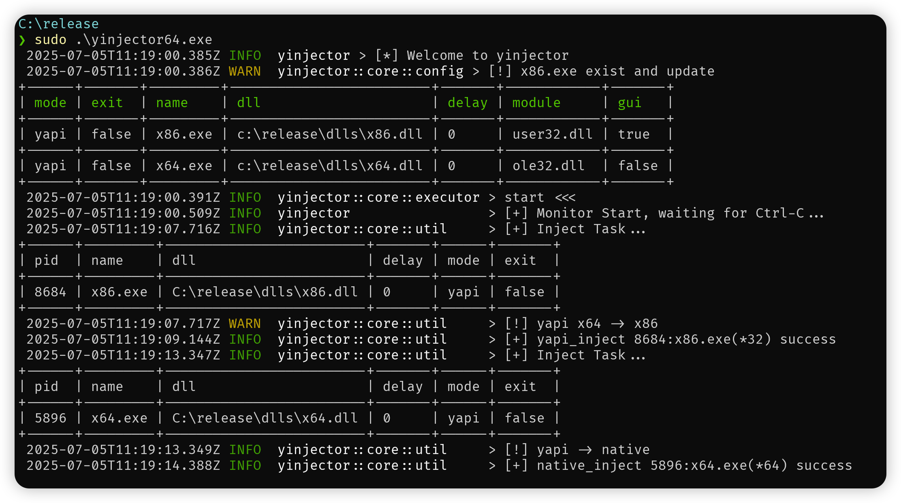

## YInjector

[](https://github.com/piz-ewing/injector/blob/main/LICENSE)


YInject is a configuration-driven Windows process injection tool based on ETW (Event Tracing for Windows), delivering precise, stable, low-overhead real-time injection.

- ✨ Fuse injector
- 👍 Configure easily
- 🚅 Monitor via ETW

## build

```bash
# install target
rustup target add x86_64-pc-windows-msvc
rustup target add i686-pc-windows-msvc

# Build 32-bit version (injector and test DLL)
cargo build --target i686-pc-windows-msvc --release -p yinjector
cargo build --target i686-pc-windows-msvc --release -p test_dll

# Build 64-bit version (injector and test DLL)
cargo build --target x86_64-pc-windows-msvc --release -p yinjector
cargo build --target x86_64-pc-windows-msvc --release -p test_dll

# publish
./publish.ps1
```

## config

```toml
# ===============================
# Global configuration
# ===============================
[global]

# Injection mode:
# - 'native'    : Standard Windows API (x86 → x86, x64 → x64)
# - 'yapi'      : Cross-architecture via yapi (x86 ↔ x64); unstable
# - 'wow64ext'  : x86 → x64 via WoW64Ext; unstable, x86 builds only
mode = 'yapi'

# Injector exit behavior after injection:
# true  - exit immediately after injecting
# false - stay running (useful for debugging or monitoring multiple processes)
exit = false


# ===============================
# Easy mapping: Static DLL bindings
# ===============================
[easy]

# Maps a target process name (as seen in Task Manager)
# to a DLL path to inject automatically.

# Example:
# Inject 'dlls/x86.dll' when 'x86.exe' is launched
'x86.exe' = 'dlls/x86.dll'


# ===============================
# Advanced mapping: Flexible injection rules
# ===============================

# Define one or more [[mix]] blocks for advanced control.

# -------- Mix entry 1 --------
[[mix]]
# Target process name
name = 'x86.exe'

# DLL path to inject
dll = 'dlls/x86.dll'

# Optional: delay (in milliseconds) before injection
delay = 0

# Injection constraints
[mix.limit]
# Inject only if this module is loaded in the target process
# (e.g., 'user32.dll' to detect GUI readiness)
module = 'user32.dll'

# Optional: additionally require presence of user32.dll (indicates GUI process)
gui = true


# -------- Mix entry 2 --------
[[mix]]
name = 'x64.exe'
dll = 'dlls/x64.dll'

[mix.limit]
# Inject only if 'ole32.dll' is present in the target process
module = 'ole32.dll'
```

## run

```
./injector.exe [config_path]
```



## todo

- [ ] ❌ [Bug] YAPI and WoW64Ext are unstable — use native mode instead
- [ ] ⚙️ Support hot reload for config

## ref

**_thx_**

[YAPI -- Yet Another Process Injector](https://github.com/ez8-co/yapi.git) @ez8-co

[rewolf-wow64ext](https://github.com/rwfpl/rewolf-wow64ext) @rwfpl

[pretty-env-logger](https://github.com/seanmonstar/pretty-env-logger.git) @seanmonstar

[remove absolute paths in release binary](https://users.rust-lang.org/t/how-to-remove-absolute-paths-in-release-binary/75969)

[windows-win-rs](https://github.com/DoumanAsh/windows-win-rs.git)
